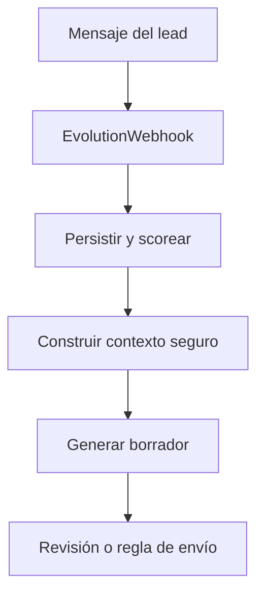
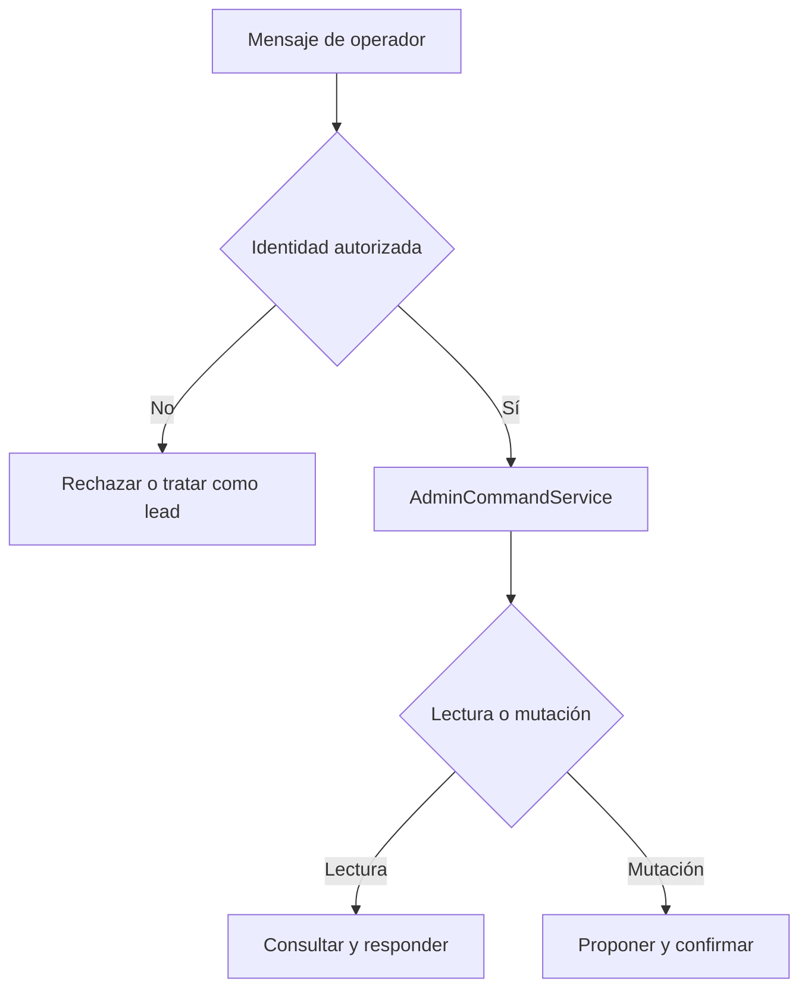

# Arquitectura y Flujo Principal

## Modelo mental actualizado

```text
Evolution API = transporte de WhatsApp
NestJS = reglas, permisos y orquestación
Supabase = datos y archivos
AiProvider = capacidad de interpretación y redacción
Samuel = autoridad humana
```

## Implementación observada

<!-- AUTO:BEGIN architecture-state -->
![[Arquitectura actual]]
<!-- AUTO:END architecture-state -->

## Módulos planeados

- `ConversationContextModule`.
- `ResponseDraftModule`.
- `InventoryModule`.
- `AdminCommandsModule`.
- `ReportsModule`.
- `HumanHandoffModule`.
- `MediaModule`.
- `WhatsAppSenderModule`.

No documentar un módulo planeado como implementado hasta comprobarlo en el repositorio.

## Ruta del cliente



Durante desarrollo, el flujo termina en el borrador.

## Ruta administrativa



## Límite de autoridad

| Pieza | Puede | No puede |
| --- | --- | --- |
| IA | Interpretar, extraer, resumir, redactar | Ejecutar SQL o enviar por sí sola |
| NestJS | Validar, consultar, autorizar, transaccionar | Inventar información faltante |
| Supabase | Persistir datos y archivos | Decidir reglas comerciales |
| Evolution API | Transportar mensajes y medios | Autorizar acciones de negocio |
| Samuel | Aprobar, corregir, tomar control | Ser identificado solo porque el texto dice “soy Samuel” |

## Flujo futuro de respuesta basada en inventario

```text
Lead pregunta
→ intención y filtros
→ InventoryQueryService
→ datos reales
→ ResponsePlanner
→ borrador con IDs de medios
→ validación
→ aprobación o regla segura
→ envío
```

## Flujo futuro de reportes

```text
Samuel pide reporte
→ autorización
→ consulta determinista
→ datos del periodo
→ formateador o resumen IA
→ respuesta a Samuel
```

## Seguridad estructural

- Separación por `business_id`.
- Operadores allowlisted.
- Acciones mutables con confirmación.
- `AUTO_SEND_MESSAGES=false` durante desarrollo y piloto inicial.
- No usar `raw_payload` como contexto de IA.
- Medios en almacenamiento privado.
- Logs sin secretos.
- Pruebas sin llamadas externas.
