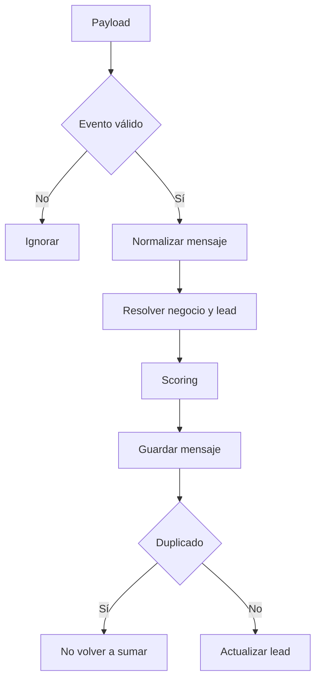

# Flujo Interno — Evolution Webhook Service

## Responsabilidad actual

Orquestar la entrada de mensajes válidos hasta su persistencia y scoring.

## Secuencia conocida

1. Recibir payload.
2. Normalizar el nombre del evento.
3. Aceptar `messages.upsert`.
4. Ignorar `fromMe`.
5. Ignorar grupos.
6. Extraer mensaje.
7. Extraer teléfono, nombre e ID.
8. Identificar la instancia.
9. Buscar negocio activo.
10. Crear o actualizar lead.
11. Calcular señales y score.
12. Guardar mensaje.
13. Evitar duplicado.
14. Actualizar lead.
15. Responder resultado técnico al webhook.

## Diagrama

## Lo que no debe hacer todavía

- Construir prompts.
- Instanciar Gemini.
- Consultar inventario.
- Enviar WhatsApp.
- Autorizar a Samuel.
- Ejecutar reportes.

## Dirección futura

Después del Hito 4.2, la generación de borradores podrá ser llamada por una capa de orquestación. Evitar convertir el webhook en un servicio gigante.

## Seguridad

- Logs mínimos.
- Nada de secretos.
- Teléfonos enmascarados fuera de depuración autorizada.
- `raw_payload` fuera del contexto de IA.
- Errores externos traducidos sin filtrar datos.

