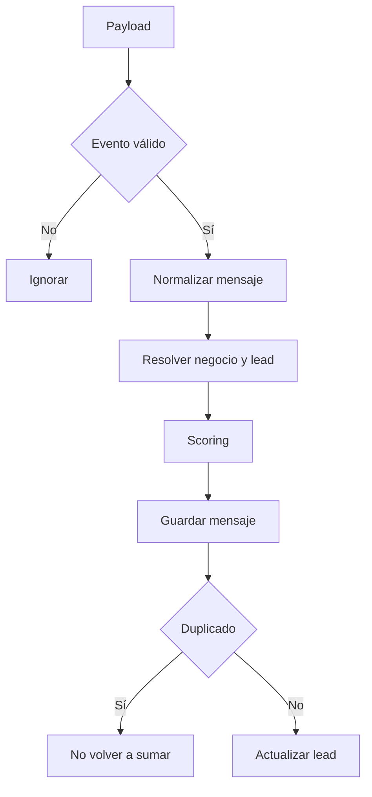

# Flujo Interno — Evolution Webhook Service

## Responsabilidad actual

Orquestar la entrada de mensajes válidos desde su persistencia y scoring hasta
la construcción de contexto, la generación segura de un borrador y su
persistencia como `PROPOSED`. En el piloto Edgar, la notificación opcional solo
puede dirigirse al operador.

## Secuencia conocida

1. Recibir payload.
2. Normalizar el nombre del evento.
3. Aceptar `messages.upsert`.
4. Ignorar `fromMe`.
5. Ignorar grupos.
6. Extraer mensaje.
7. Extraer teléfono, nombre e ID.
8. Identificar la instancia.
9. Buscar negocio activo.
10. Crear o actualizar lead.
11. Calcular señales y score.
12. Guardar mensaje.
13. Evitar duplicado.
14. Actualizar lead.
15. Construir contexto seguro.
16. Generar borrador mediante `AiProvider`/Gemini.
17. Persistir `response_drafts` como `PROPOSED`.
18. Notificar opcionalmente al operador.
19. Responder resultado técnico al webhook sin enviar a la lead.

## Diagrama

```mermaid
flowchart TD
    A["Payload"] --> B{"Evento válido"}
    B -- "No" --> C["Ignorar"]
    B -- "Sí" --> D["Normalizar mensaje"]
    D --> E["Resolver negocio y lead"]
    E --> F["Scoring"]
    F --> G["Guardar mensaje"]
    G --> H{"Duplicado"}
    H -- "Sí" --> I["No volver a sumar"]
    H -- "No" --> J["Actualizar lead"]
```

## Lo que no debe hacer todavía

- Consultar inventario.
- Enviar respuestas a leads.
- Autorizar a Samuel.
- Ejecutar reportes.

## Dirección futura

La generación de borradores ya forma parte del pipeline validado desde el Hito
4.3. Debe mantenerse encapsulada en sus servicios y no convertir el webhook en
un servicio gigante. La decisión humana se persiste por el flujo de revisión;
aprobar no equivale a enviar.

## Seguridad

- Logs mínimos.
- Nada de secretos.
- Teléfonos enmascarados fuera de depuración autorizada.
- `raw_payload` fuera del contexto de IA.
- Errores externos traducidos sin filtrar datos.

