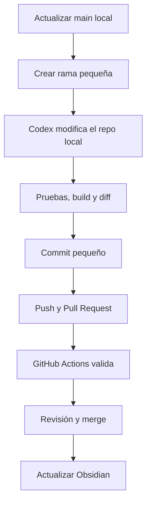

# Flujo de Trabajo — ChatGPT Work + Codex + GitHub

> [!summary] Idea central
> **El código se trabaja en la PC. GitHub conserva la verdad compartida. Codex programa y valida dentro del repositorio real. ChatGPT Work ayuda a pensar, explicar y revisar. Obsidian conserva el conocimiento del proyecto.**

Este es el flujo canónico recomendado para desarrollar el [[00 Copiloto WhatsApp Samuel - MOC|Copiloto WhatsApp Samuel]] sin depender de carpetas temporales, conversaciones aisladas o cambios que sólo existan en una herramienta.

También puede reutilizarse como base para futuros proyectos de software.

---

## 1. Decisión: trabajar `local-first`

El desarrollo cotidiano del Copiloto debe hacerse sobre el repositorio real de la PC:

```text
C:\Users\manzo\Desktop\Freelance\Copilot
```

Ahí están el entorno verdadero del proyecto, Docker, Evolution API, las dependencias, la configuración local y las herramientas necesarias para comprobar la integración.

El modelo recomendado es:

```text
PC local + VS Code + Codex
            ↓
          Git
            ↓
         GitHub
            ↓
 Pull Request + GitHub Actions
            ↓
 ChatGPT Work: revisión y dirección
            ↓
        merge a main
```

> [!rule] Regla principal
> **Ningún cambio importante debe existir solamente dentro de un chat o de un entorno temporal.**
>
> El trabajo queda realmente conservado cuando vive en un commit de Git y, cuando corresponde compartirlo, en GitHub.

---

## 2. Por qué este flujo encaja con el Copiloto

El Copiloto no es solamente código TypeScript. Su entorno local incluye:

- NestJS dentro de `agent-core`;
- Evolution API;
- Docker;
- Supabase;
- variables de entorno;
- pruebas unitarias y e2e;
- build;
- comportamiento que más adelante deberá probarse con WhatsApp de forma controlada.

Por eso la PC es el lugar principal para programar y validar integraciones reales.

GitHub funciona como puente entre herramientas y como fuente oficial compartida. ChatGPT Work puede ayudar con la arquitectura y revisar el trabajo publicado, pero un proyecto web de ChatGPT no obtiene acceso automático a una carpeta de Windows. Codex dentro de VS Code sí trabaja directamente con la carpeta abierta en el editor.

---

## 3. Responsabilidad de cada herramienta

| Herramienta            | Responsabilidad principal                                              | No debe sustituir                      |
| ---------------------- | ---------------------------------------------------------------------- | -------------------------------------- |
| PC + repositorio local | Entorno real de desarrollo y ejecución                                 | GitHub como respaldo compartido        |
| VS Code + Codex        | Leer, modificar, probar y revisar el código real                       | La decisión humana sobre el producto   |
| Git                    | Ramas, commits, diffs, historial y recuperación                        | Las pruebas de comportamiento          |
| GitHub                 | Fuente compartida, Pull Requests e historial remoto                    | El entorno local de integración        |
| GitHub Actions         | Repetir automáticamente unitarias, e2e y build                         | La revisión funcional y arquitectónica |
| ChatGPT Work           | Pensar arquitectura, delimitar tareas, explicar conceptos y revisar PR | El checkout real de la PC              |
| Obsidian               | Documentar decisiones, hitos, aprendizajes y siguiente acción          | El historial exacto de Git             |
| `AGENTS.md`            | Dar a Codex reglas permanentes del repositorio                         | El objetivo específico de cada tarea   |
| Prompt actual          | Definir el resultado concreto del ciclo presente                       | Las reglas durables del repositorio    |

Una forma corta de recordarlo:

> [!important]
> **ChatGPT piensa y enseña. Codex ejecuta. Git protege. GitHub comparte. Las pruebas demuestran. CI vigila. Obsidian recuerda.**

---

## 4. Fuentes de verdad

No toda la información debe guardarse en el mismo lugar.

| Información                   | Fuente de verdad                    |
| ----------------------------- | ----------------------------------- |
| Código actual                 | Rama y commit de Git                |
| Versión compartida            | GitHub                              |
| Validaciones automáticas      | GitHub Actions                      |
| Decisión arquitectónica       | ADR dentro del proyecto             |
| Estado del hito               | Nota correspondiente en `02 Hitos/` |
| Próxima acción física         | Panel del proyecto                  |
| Reglas permanentes para Codex | `AGENTS.md`                         |
| Alcance de la tarea actual    | Prompt del chat activo              |
| Explicación estable del flujo | Esta nota                           |

Esto evita copiar el mismo estado en cinco lugares y después no saber cuál está actualizado.

---

## 5. Flujo completo para cada cambio



### Paso 1 — Elegir un resultado pequeño

Cada ciclo debe buscar un resultado verificable.

Evitar:

```text
Trabaja en todo el Hito 4.
```

Preferir:

```text
Crea el contrato neutral AiProvider y sus tipos.
No implementes Gemini, no conectes la IA al webhook y no habilites envíos.
Termina cuando unitarias, e2e y build pasen.
```

### Paso 2 — Actualizar `main`

Antes de abrir una rama:

```powershell
cd C:\Users\manzo\Desktop\Freelance\Copilot
git switch main
git pull --ff-only origin main
git status
```

Confirmar:

- que estás en `main`;
- que `main` está sincronizada;
- que no existen cambios locales olvidados;
- que el punto de partida es el correcto.

### Paso 3 — Crear una rama por resultado

Ejemplo:

```powershell
git switch -c feature/hito-4-1-ai-provider
```

Convenciones útiles:

```text
feature/hito-x-descripcion
fix/problema-concreto
test/comportamiento-cubierto
docs/tema-documentado
chore/mantenimiento
```

No crear una rama nueva para cada archivo. La rama representa un resultado coherente.

### Paso 4 — Abrir el repositorio real en Codex

Abrir la carpeta del proyecto en VS Code y confirmar que Codex está trabajando en la ruta correcta.

Antes de editar, pedirle que muestre:

- rama actual;
- estado de Git;
- estructura relevante;
- archivos que planea tocar;
- validaciones que ejecutará.

### Paso 5 — Dar un contrato claro a Codex

Un buen prompt contiene cuatro partes:

```text
Objetivo:
[Resultado concreto.]

Contexto:
[Archivos, comportamiento actual y decisiones relacionadas.]

Restricciones:
[Qué no debe tocar, habilitar o cambiar.]

Terminado cuando:
[Comportamiento y comandos que deben quedar verdes.]
```

Para el Copiloto, mencionar explícitamente cuando aplique:

- no leer, imprimir ni modificar `.env`;
- no utilizar credenciales reales en pruebas;
- mantener `AUTO_SEND_MESSAGES=false`;
- no enviar WhatsApps reales;
- no conectar la IA al webhook sin autorización expresa;
- mantener la IA desacoplada mediante `AiProvider`;
- no inventar inventario, precios, archivos ni permisos;
- evitar refactors ajenos al hito;
- conservar el aislamiento por `business_id`.

### Paso 6 — Codex inspecciona, implementa y explica

Codex debe trabajar sobre el repositorio local y:

1. inspeccionar primero el código relevante;
2. proponer o confirmar el cambio mínimo;
3. modificar solamente los archivos necesarios;
4. agregar o actualizar pruebas;
5. ejecutar las validaciones;
6. revisar el diff;
7. explicar qué cambió y por qué.

Para cambios complejos —arquitectura, migraciones, seguridad, concurrencia o varias capas— conviene usar Plan mode antes de programar.

### Paso 7 — Validar en la PC

Desde `agent-core`:

```powershell
npm test
npm run test:e2e
npm run build
```

Agregar lint o formato cuando formen parte del baseline del repositorio.

También revisar:

```powershell
git status
git diff
git diff --stat
```

Preguntas antes de aceptar:

- ¿Sólo se tocaron archivos dentro del alcance?
- ¿Las pruebas demuestran el comportamiento solicitado?
- ¿El build está verde?
- ¿Se mantuvo `AUTO_SEND_MESSAGES=false`?
- ¿Se evitó usar información o credenciales reales?
- ¿El cambio conserva la arquitectura acordada?
- ¿Quedó algún riesgo o pendiente?

### Paso 8 — Crear un commit pequeño

Seleccionar únicamente los archivos revisados:

```powershell
git add ruta/del/archivo
git commit -m "feat: add provider-neutral AI contract"
```

Evitar `git add .` hasta haber comprobado que no incluye:

- `.env`;
- secretos;
- `node_modules`;
- `dist`;
- logs;
- datos reales de clientes;
- archivos generados sin intención.

Un commit pequeño debe:

- tener un solo propósito;
- poder explicarse fácilmente;
- conservar el proyecto en estado válido;
- ser sencillo de revisar o revertir.

### Paso 9 — Subir la rama y abrir un Pull Request

```powershell
git push --set-upstream origin feature/hito-4-1-ai-provider
```

En el Pull Request anotar:

- objetivo;
- cambio realizado;
- archivos principales;
- pruebas ejecutadas;
- restricciones respetadas;
- riesgos o pendientes fuera del alcance.

### Paso 10 — Dejar que GitHub Actions repita la evidencia

GitHub Actions debe confirmar:

- pruebas unitarias;
- prueba e2e;
- build;
- cualquier otro check obligatorio que se agregue después.

> [!warning]
> Que funcione en la PC es necesario, pero CI comprueba que también funciona desde una instalación limpia y reproducible.

### Paso 11 — Revisar desde ChatGPT Work

Una vez publicada la rama o el PR, ChatGPT Work puede:

- comparar el cambio contra el objetivo;
- revisar la arquitectura;
- explicar el diff;
- detectar riesgos;
- revisar resultados de GitHub Actions;
- recomendar el siguiente cambio pequeño;
- preparar la actualización de documentación.

ChatGPT Work debe revisar información publicada o compartida. No se debe asumir que ve automáticamente cambios que sólo existen en la PC.

### Paso 12 — Hacer merge y actualizar el estado

Cuando el PR esté aprobado y los checks estén verdes:

1. hacer merge a `main`;
2. actualizar `main` en la PC;
3. marcar la evidencia real en la nota del hito;
4. actualizar la próxima acción física;
5. registrar un ADR solamente si hubo una decisión arquitectónica;
6. iniciar el siguiente ciclo en una rama nueva.

---

## 6. Cómo incluir a ChatGPT Work y Codex sin perder continuidad

### Proyecto de ChatGPT

Mantener un proyecto llamado `Copiloto WhatsApp Samuel` para reunir:

- conversaciones relacionadas;
- arquitectura;
- decisiones;
- documentación compartida;
- resúmenes de hitos;
- explicaciones y revisiones.

Crear un chat distinto por resultado coherente, por ejemplo:

```text
Hito 4.1 — Contrato AiProvider
Hito 4.1 — Implementación GeminiProvider
Hito 4.1 — Pruebas de Gemini simulado
Revisión PR — Hito 4.1
```

El proyecto conserva contexto compartido, pero cada chat permanece enfocado.

### Codex en VS Code

Usarlo para trabajar directamente sobre:

```text
C:\Users\manzo\Desktop\Freelance\Copilot
```

Ahí Codex puede leer el código actual, hacer cambios, ejecutar comandos y mostrar el diff real.

### GitHub como puente

GitHub conecta ambas superficies:

```text
Codex local modifica
        ↓
Git conserva
        ↓
GitHub publica
        ↓
ChatGPT Work revisa
```

Sin GitHub, habría que copiar archivos, pegar diffs o depender de transferencias manuales. Con ramas y PR, cada herramienta trabaja sobre una referencia verificable.

---

## 7. `AGENTS.md`: memoria técnica permanente para Codex

El prompt explica la tarea de hoy. `AGENTS.md` explica cómo debe trabajarse siempre en este repositorio.

Debe vivir en la raíz Git del proyecto:

```text
Copilot/
├─ AGENTS.md
├─ agent-core/
├─ supabase/
└─ ...
```

Contenido inicial recomendado:

```md
# Copiloto WhatsApp Samuel

## Architecture

- The backend lives in `agent-core/` and uses NestJS.
- The main flow is WhatsApp -> Evolution API -> NestJS -> Supabase.
- AI providers must implement the provider-neutral `AiProvider` contract.
- Gemini is the initial primary provider; Groq is complementary or fallback.
- Inventory, prices, files, permissions and human handoff are controlled by
  NestJS, never invented by an AI provider.

## Safety

- Never read, print, edit or commit `.env`, credentials, tokens or customer data.
- Never send real WhatsApp messages unless the task explicitly authorizes it.
- Keep `AUTO_SEND_MESSAGES=false` during development.
- Do not connect AI generation to the Evolution webhook without explicit approval.
- Do not run destructive Git, Docker or Supabase commands without authorization.

## Engineering workflow

- Keep each change scoped to one small, reviewable result.
- Inspect the current branch and Git status before editing.
- Add or update tests for behavior changes.
- Run `npm test`, `npm run test:e2e` and `npm run build`.
- Review the final diff before committing.
- Do not refactor unrelated modules.

## Definition of done

A change is complete only when:

1. the requested behavior is implemented;
2. relevant tests pass;
3. the e2e baseline still passes;
4. the build passes;
5. the diff contains only intended changes;
6. remaining risks are reported.
```

Mantenerlo corto y corregirlo conforme aparezcan errores repetidos. Las reglas de comportamiento crítico también deben vivir en pruebas o CI; `AGENTS.md` guía a Codex, pero no reemplaza controles automáticos.

---

## 8. Qué información vive en cada capa

| Si la instrucción es…                            | Debe vivir en…      |
| ------------------------------------------------ | ------------------- |
| Sólo para la tarea actual                        | Prompt              |
| Permanente para este repositorio                 | `AGENTS.md`         |
| Comportamiento que nunca debe romperse           | Prueba automatizada |
| Check obligatorio en cada PR                     | GitHub Actions      |
| Decisión arquitectónica que no debe replantearse | ADR                 |
| Explicación técnica estable                      | `04 Docs/`          |
| Estado y siguiente acción                        | Panel del proyecto  |
| Procedimiento repetido y maduro                  | Skill               |
| Acción periódica y confiable                     | Automatización      |

> [!rule]
> **Lo permanente vive en Git. Lo específico vive en el prompt. Lo demostrable vive en pruebas. Lo obligatorio vive en CI. Lo histórico y explicativo vive en Obsidian.**

---

## 9. Cuándo usar un entorno cloud o un worktree

El flujo local es el predeterminado, no la única posibilidad.

Un entorno aislado o worktree sirve cuando:

- la tarea puede hacerse sin servicios locales especiales;
- se quiere investigar o programar en paralelo;
- cada trabajo usa una rama distinta;
- el resultado puede validarse dentro de ese entorno;
- existe una ruta clara para publicar o transferir el cambio.

Mantener el trabajo en la PC cuando:

- se necesita Docker o Evolution API local;
- se requiere probar la integración real;
- la configuración sólo existe localmente;
- se quiere inspeccionar y ejecutar todo en el IDE habitual.

> [!warning]
> No trabajar simultáneamente sobre la misma rama desde dos checkouts. Para trabajo paralelo, usar ramas o worktrees distintos.

---

## 10. Errores que este flujo evita

### Cambio perdido en un entorno temporal

Solución: convertir el resultado útil en commit y publicarlo en una rama.

### ChatGPT Work asume que ve la PC

Solución: compartir el archivo necesario o, preferentemente, publicar la rama o el PR.

### Dos herramientas modifican la misma rama

Solución: un solo checkout dueño de la rama o ramas separadas.

### “Ya quedó” sin evidencia

Solución: exigir unitarias, e2e, build, diff y CI antes de declarar terminado.

### Reglas importantes repetidas en cada prompt

Solución: mover reglas durables a `AGENTS.md`.

### Obsidian se convierte en copia del historial de Git

Solución: documentar decisiones, explicaciones y estado; dejar commits y diffs en Git.

### Secretos dentro de archivos compartidos

Solución: excluir `.env`, credenciales, datos reales, `.git`, `node_modules` y `dist`.

---

## 11. Checklist corto de cada ciclo

### Antes de programar

- [ ] Elegí un resultado pequeño.
- [ ] `main` está actualizada.
- [ ] El árbol de trabajo está limpio.
- [ ] Creé o confirmé la rama correcta.
- [ ] El prompt tiene objetivo, contexto, restricciones y terminado cuando.

### Antes del commit

- [ ] Revisé `git diff`.
- [ ] Sólo cambiaron archivos esperados.
- [ ] Pasaron las pruebas unitarias.
- [ ] Pasó la prueba e2e.
- [ ] Pasó el build.
- [ ] No se incluyeron secretos ni datos reales.
- [ ] El envío automático sigue desactivado.

### Antes del merge

- [ ] La rama está en GitHub.
- [ ] El Pull Request explica el alcance.
- [ ] GitHub Actions está verde.
- [ ] Se revisaron riesgos y arquitectura.
- [ ] La documentación afectada está actualizada.

### Después del merge

- [ ] Actualicé `main` local.
- [ ] Actualicé la nota del hito.
- [ ] Actualicé la próxima acción física.
- [ ] La siguiente tarea comenzará en una rama nueva.

---

## 12. Ubicación recomendada en MainVault

Esta nota debe reemplazar la versión anterior ubicada en:

```text
10 Projects/
└─ Copiloto WhatsApp Samuel/
   └─ 04 Docs/
      └─ Flujo de Trabajo - ChatGPT Web + Codex.md
```

No crear otra copia dentro de `30 Resources/` todavía. Aunque el modelo es reutilizable, esta versión contiene reglas específicas del Copiloto.

Cuando el mismo flujo se haya aplicado a varios proyectos, se puede extraer una versión totalmente genérica hacia:

```text
30 Resources/
└─ Codex/
   └─ Flujo local-first con ChatGPT Work, Codex y GitHub.md
```

Y dejar en esta nota únicamente las reglas específicas del Copiloto.

Agregar al apartado **Documentación técnica** de [[00 Copiloto WhatsApp Samuel - MOC]]:

```md
- [[Flujo de Trabajo - ChatGPT Web + Codex]]
```

---

## 13. Regla final

> [!important]
> No necesitas coordinar cinco herramientas al mismo tiempo.
>
> Sólo completa una vuelta:
>
> **definir → abrir rama → programar → probar → revisar → commit → push → PR → CI → merge → documentar**

Para una mente TDAH, la clave no es sostener todo el proyecto en la cabeza. La clave es que cada herramienta conserve una parte del sistema y que siempre exista una siguiente acción física pequeña.

---

## Fuentes oficiales

- [Codex — Best practices](https://learn.chatgpt.com/guides/best-practices.md)
- [Projects and chats](https://learn.chatgpt.com/docs/projects.md)
- [Custom instructions with AGENTS.md](https://learn.chatgpt.com/docs/agent-configuration/agents-md)
- [Codex IDE extension](https://learn.chatgpt.com/docs/codex/ide)
- [Cloud environments](https://learn.chatgpt.com/docs/environments/cloud-environment)
- [Code review](https://learn.chatgpt.com/docs/code-review)
- [Git worktrees](https://learn.chatgpt.com/docs/environments/git-worktrees)
