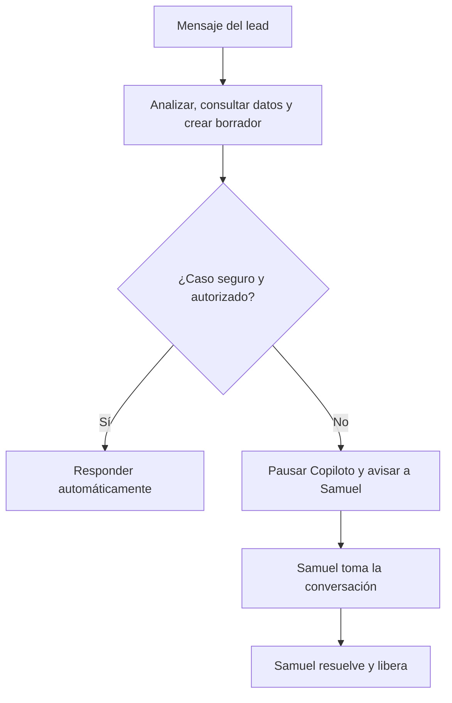

# Modelo operativo híbrido — Automatización y relevo humano

> [!summary] Idea central
> La revisión humana y los borradores no cancelan la automatización. Son la base segura para enseñarle al sistema qué puede resolver solo y cuándo debe detenerse para que Samuel tome el control.

> [!important] Resultado buscado
> **La IA atiende el volumen; Samuel interviene en los momentos importantes y cierra la venta.**

## En pocas palabras

El Copiloto debe evolucionar gradualmente:

1. Primero propone respuestas y Samuel las revisa.
2. Después se miden aprobaciones, ediciones y rechazos.
3. Los casos repetitivos y seguros se autorizan para respuesta automática.
4. Los casos sensibles o comerciales se transfieren a Samuel.
5. Samuel conserva el control hasta liberar la conversación.

La meta no es que Samuel apruebe eternamente cada saludo. La revisión inicial sirve para calibrar el sistema antes de activar el piloto automático por niveles.

## Flujo operativo objetivo

Este es el flujo objetivo futuro. Durante el Hito 4.4, el proceso termina en la decisión humana y **todavía no envía mensajes**.

## Los tres modos de operación

| Modo | Qué ocurre | Para qué sirve |
| --- | --- | --- |
| **Supervisado** | Cada borrador espera aprobación, edición o rechazo. | Calibrar calidad y comprobar que la IA responde correctamente. |
| **Híbrido** | Los casos permitidos se responden automáticamente; los demás se transfieren. | Atender volumen sin perder control comercial. |
| **Humano** | El Copiloto no responde a ese lead; Samuel controla la conversación hasta liberarla. | Citas, cotizaciones, negociación, documentos y situaciones delicadas. |

### Distinción técnica recomendada

Aunque para Samuel se perciban como tres modos, conviene representarlos en dos ejes diferentes:

| Eje | Estados conceptuales | Alcance |
| --- | --- | --- |
| Política de automatización | `SUPERVISED` o `HYBRID` | Configuración del negocio. |
| Control de la conversación | `BOT` o `HUMAN` | Estado individual de cada lead. |

Así, el negocio puede operar en modo híbrido mientras una conversación concreta permanece bajo control humano.

> [!note]
> Los nombres anteriores son una propuesta conceptual, no un esquema de base de datos aprobado. El diseño deberá fijarse cuando corresponda implementar el relevo humano.

## Qué puede automatizar el Copiloto

Una vez que exista inventario real, reglas probadas y un sender autorizado, el Copiloto podrá encargarse de:

- saludar y presentarse;
- preguntar qué vehículo busca el lead;
- consultar inventario real;
- mostrar modelos, versiones, colores y fotografías autorizadas;
- informar precios y disponibilidad registrados;
- responder preguntas frecuentes;
- comparar vehículos usando datos confiables;
- detectar interés y actualizar el score;
- realizar seguimientos sencillos permitidos.

La automatización solo debe usar información obtenida de fuentes confiables. La IA no debe inventar vehículos, precios, colores, disponibilidad, fotografías ni condiciones comerciales.

## Qué casos deben pasar a Samuel

El relevo humano puede activarse cuando el lead:

- solicita una prueba de manejo o una cita;
- pide una cotización formal;
- quiere iniciar financiamiento;
- comparte o solicita documentos;
- quiere negociar precio, enganche o mensualidad;
- muestra intención fuerte de compra;
- hace una pregunta que no puede responderse con seguridad;
- pide hablar directamente con Samuel;
- presenta una queja o una situación delicada.

Algunas señales podrán configurarse para **avisar** a Samuel sin transferir inmediatamente; otras deberán pausar al Copiloto en ese momento. Esa política se definirá y probará antes de activar el modo híbrido.

## Qué ocurre durante el relevo humano

Cuando una conversación entra en modo `HUMAN`:

- se siguen recibiendo y guardando los mensajes;
- el historial y el scoring pueden continuar actualizándose;
- no se envía ninguna respuesta automática;
- Samuel es el único responsable de los mensajes salientes;
- el Copiloto no compite con Samuel ni responde al mismo tiempo;
- la conversación permanece pausada hasta una liberación explícita.

Para evitar una cola de borradores obsoletos, lo recomendable es no crear borradores enviables mientras Samuel tiene el control. En el futuro podrían generarse sugerencias privadas bajo demanda, claramente separadas del envío.

## Auditoría mínima del relevo

Conceptualmente, el sistema deberá recordar:

- modo actual de la conversación;
- motivo del relevo;
- mensaje que lo provocó;
- fecha y hora del relevo;
- operador que tomó el control;
- fecha, hora y operador que liberó la conversación.

Esto permitirá reconstruir qué ocurrió y evitar que el bot se reactive accidentalmente.

## Diferencia entre borrador, decisión, envío y relevo

| Concepto | Significado |
| --- | --- |
| **Borrador** | Texto propuesto por la IA. |
| **Decisión humana** | Aprobar, editar y aprobar, o rechazar el borrador. |
| **Envío** | Acción separada que entrega un mensaje por WhatsApp. |
| **Relevo humano** | Cambio de control que impide respuestas automáticas para ese lead. |

> [!warning] Invariante de seguridad
> Un borrador no es una decisión. Una decisión aprobada no es todavía un envío. El envío solo existirá cuando un hito futuro lo autorice explícitamente.

## Cómo encaja con el roadmap actual

| Etapa | Qué aporta al modelo híbrido |
| --- | --- |
| **Hito 4.4 — Revisión humana** | Aprobar, editar, rechazar, preservar el original y auditar la decisión. Sin envío. |
| **Hitos 5.x — Inventario confiable** | Proporcionar vehículos, precios, colores, disponibilidad, medios y documentos reales. |
| **Hito 6.2 — Transferencia y pausa** | Permitir tomar, pausar y liberar conversaciones de manera auditable. |
| **Piloto supervisado** | Medir la calidad con tráfico real controlado. |
| **Automatización de casos seguros** | Activar el envío únicamente para intenciones permitidas y probadas. |

Relaciones:

- [[Hito 04.4 - Revision y aprobacion humana DONE]]
- [[Vision y Roadmap del Producto]]
- [[Arquitectura y Flujo Principal]]
- [[Copiloto WhatsApp IA Multimodal e Inventario]]
- [[Administracion del Inventario por WhatsApp]]
- [[Plan Desarrollo Piloto y Produccion Copiloto WhatsApp]]

## Cómo decidir qué puede automatizarse

Durante el modo supervisado conviene medir por tipo de intención:

- porcentaje de borradores aprobados sin cambios;
- porcentaje editado antes de aprobar;
- porcentaje rechazado;
- motivos de edición o rechazo;
- errores de datos o alucinaciones;
- transferencias a Samuel;
- tiempo de primera respuesta;
- intentos de respuesta simultánea entre Samuel y el Copiloto.

Una categoría debería automatizarse solamente cuando:

1. aparece con suficiente frecuencia;
2. usa datos confiables;
3. Samuel la aprueba casi siempre sin cambios;
4. el riesgo de equivocación es bajo;
5. existe una regla clara de escape hacia Samuel;
6. puede desactivarse rápidamente si falla.

## Activación gradual recomendada

### Nivel 0 — Sin envío

- Se generan y persisten borradores.
- Samuel revisa decisiones.
- Es el estado correspondiente al Hito 4.4.

### Nivel 1 — Piloto supervisado

- Samuel aprueba cada respuesta antes de enviarla.
- Se registran métricas por intención.

### Nivel 2 — Automatización permitida

- Solo saludos y preguntas rutinarias incluidas en una allowlist.
- Cualquier duda o señal sensible se detiene.

### Nivel 3 — Operación híbrida

- El Copiloto atiende el recorrido informativo completo con datos reales.
- Samuel recibe y resuelve los momentos comerciales importantes.

### Nivel 4 — Expansión controlada

- Se agregan nuevas categorías una por una.
- Cada categoría conserva métricas, límites y rollback.

## Reglas que nunca deben romperse

1. Solo una parte controla los mensajes salientes de cada lead a la vez.
2. En modo `HUMAN`, el Copiloto no envía nada.
3. Los datos comerciales provienen de fuentes confiables.
4. La identidad de Samuel u otro operador se obtiene de autenticación confiable.
5. Toda decisión, transferencia, liberación y envío queda auditado.
6. La incertidumbre conduce a pausa o revisión, no a inventar una respuesta.
7. La automatización se activa por categorías pequeñas y reversibles.

## Estado actual y siguiente paso

> [!todo] Ahora
> Completar el Hito 4.4 empezando por 4.4-A: persistencia auditable de decisiones humanas mediante `response_draft_decisions`.

El modo híbrido descrito aquí **no debe mezclarse dentro de 4.4-A**. Esta nota conserva la dirección del producto para construir cada base en el orden correcto.

## Frase guía

> **La IA propone y atiende lo repetitivo. NestJS controla. Los datos confiables fundamentan la respuesta. Samuel toma los casos importantes.**
