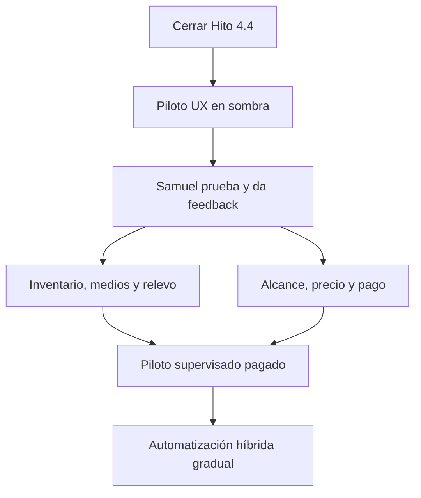

# 🚦 Nota clave — Camino al piloto UX con Samuel

> [!important] La transición más importante del proyecto
> El Copiloto está cerca de dejar de ser solamente un backend bien probado y comenzar a convertirse en un **producto que Samuel puede ver, usar, evaluar y pagar**.
>
> El siguiente gran objetivo no es activar todo de golpe. Es avanzar de forma controlada desde la revisión humana hasta un piloto real, medible y comercial.

> [!summary] Norte del producto
> **La IA atiende el volumen y prepara la conversación. Samuel conserva el control, interviene en los momentos importantes y cierra la venta.**

---

## 🧭 Lectura diaria de 3 minutos

Mientras el piloto pagado no haya comenzado, revisar estas cinco preguntas al iniciar un bloque de trabajo:

1. **¿Cuál es la siguiente acción física del hito actual?**
2. **¿Lo que voy a hacer acerca el Copiloto a una prueba visible con Samuel?**
3. **¿Estoy manteniendo separado el alcance actual de funciones futuras?**
4. **¿Sigue protegido el sistema contra envíos accidentales?**
5. **¿Hay una duda que debo resolver antes de implementar o prometer algo?**

> [!todo] Siguiente acción viva del repositorio
> ![[Siguiente accion]]

> [!rule] Regla contra la dispersión
> Terminar el bloque actual, demostrarlo y validarlo antes de agregar inventario, multimedia, envío, hosting o automatización.

---

## 📍 Dónde estamos realmente

Al crear esta nota, el proyecto se encuentra en el **Hito 4.4 — Revisión y aprobación humana**.

La siguiente pieza es `4.4-A`, basada en una entidad separada llamada `response_draft_decisions`, para conservar el borrador original y registrar de forma auditable si un operador:

- aprueba;
- edita y aprueba;
- rechaza.

Durante todo el Hito 4.4, la IA propone, Samuel decide y la decisión queda auditada, pero todavía no se envía nada.

Invariantes actuales:

- `response_drafts.text` conserva el texto original.
- Aprobar un borrador **no equivale a enviarlo**.
- `sender=false`.
- `AUTO_SEND_MESSAGES=false`.
- No hay envío automático ni manual desde el nuevo flujo de revisión.

> [!warning] No confundir “cerca del final”
> Cerrar 4.4 no significa que toda la producción esté terminada. Significa que estará terminada la **base segura de texto y decisión humana**. Ahí comienza lo más valioso: poner el producto frente a Samuel, aprender de su uso real y convertirlo en un servicio pagado.

---

## 🏁 Las cuatro metas que sí importan

| Meta | Resultado visible |
| --- | --- |
| **1. Cerrar la base segura** | Samuel puede aprobar, editar o rechazar sin que nada se envíe. |
| **2. Validar la experiencia** | Samuel usa una interfaz mínima con conversaciones y borradores reales en modo sombra. |
| **3. Probar el valor comercial** | El Copiloto consulta inventario real, propone texto y medios correctos, y ahorra trabajo. |
| **4. Convertirlo en servicio** | Existe un piloto pagado, infraestructura financiada y un camino medible hacia el modo híbrido. |

---

## 🛣️ Camino completo hacia el piloto y la producción

### Etapa 1 — Cerrar Hito 4.4

Completar en orden:

- **4.4-A:** persistencia auditable de decisiones humanas;
- **4.4-B:** servicio de revisión humana;
- **4.4-C:** API administrativa con identidad confiable;
- **4.4-D:** pruebas, idempotencia y demostración de ausencia de envío.

Resultado:

> Samuel puede decidir sobre un borrador, pero el sistema todavía no contacta al lead.

### Etapa 2 — Construir el piloto UX en sombra

Después de cerrar 4.4, crear una interfaz mínima para que Samuel pueda usar el flujo sin afectar WhatsApp.

La pantalla mínima debe mostrar:

- lista de conversaciones o borradores pendientes;
- mensaje original del lead;
- contexto reciente de la conversación;
- score y clasificación del lead;
- texto propuesto por la IA;
- botones **Aprobar**, **Editar y aprobar** y **Rechazar**;
- historial de decisiones;
- aviso muy visible: **“Esta acción todavía no envía mensajes”**.

> [!note] Bloque recomendado, todavía no canónico
> Puede manejarse como un pequeño hito de preparación del piloto —por ejemplo, `4.5`—, pero el número y alcance deben fijarse en el roadmap antes de implementarlo. No debe mezclarse dentro de 4.4-A.

### Etapa 3 — Invitar a Samuel al modo sombra

No es necesario esperar hasta que todo el inventario, multimedia y producción estén terminados.

Primero Samuel puede evaluar:

- si entiende la interfaz;
- si el contexto mostrado es suficiente;
- si los borradores suenan como él;
- si aprobar, editar y rechazar resulta rápido;
- qué tipos de respuesta aprobaría siempre;
- cuáles desea conservar bajo control humano;
- qué información necesita ver antes de confiar.

El modo sombra puede comenzar con texto. Después se amplía para mostrar inventario y multimedia antes de habilitar cualquier envío.

### Etapa 4 — Integrar inventario y respuestas multimedia

Para el piloto real con leads, el Copiloto debe ser más que un redactor. Necesita contestar con información comercial verdadera.

Dependencias del inventario:

- **5.1:** modelo de inventario y consultas;
- **5.2:** fotografías, fichas y documentos;
- **5.3:** administración inicial de solo lectura;
- **5.4:** mutaciones confirmadas y seguras;
- **5.5:** respuestas fundamentadas en inventario real.

Dependencias operativas y multimedia relevantes:

- **6.2:** transferencia, pausa y liberación de conversaciones;
- **7.4:** envío controlado de medios autorizados;
- un sender futuro con idempotencia, auditoría y apagado de emergencia.

### Etapa 5 — Acordar el piloto pagado

Después de una demostración y una ronda pequeña de feedback:

1. delimitar el alcance del piloto real;
2. acordar qué sí y qué no hará el Copiloto;
3. fijar duración, soporte y criterios de éxito;
4. presentar precio y forma de pago;
5. recibir aceptación y el pago o anticipo acordado;
6. solamente entonces preparar el despliegue vivo.

### Etapa 6 — Desplegar la versión supervisada

El primer despliegue debe activar este flujo: el lead escribe; el Copiloto analiza y consulta datos reales; propone texto y medios; Samuel revisa y aprueba; el sistema envía una sola vez; y todo queda auditado.

El hosting inicial puede ser económico, pero debe elegirse después de medir los recursos reales del stack. El piloto no debe convertirse en una prueba de fallos provocados por falta de memoria, almacenamiento o respaldo.

### Etapa 7 — Activar el modo híbrido gradualmente

Solo después de recopilar decisiones suficientes de Samuel:

- automatizar una categoría pequeña;
- medirla;
- conservar un apagado rápido;
- corregirla;
- agregar la siguiente categoría.

Primeras candidatas:

- saludos;
- preguntar qué vehículo busca;
- horarios y ubicación;
- preguntas frecuentes verificadas;
- consultas exactas de inventario;
- envío de fotografías ya autorizadas.

Casos que permanecen con Samuel:

- cotizaciones formales;
- financiamiento;
- documentos sensibles;
- negociación de precio, enganche o mensualidad;
- prueba de manejo o cita importante;
- quejas;
- baja confianza;
- leads con intención fuerte de compra.

---

## 👤 Qué debe experimentar Samuel en el piloto UX en sombra

El objetivo no es impresionarlo con una pantalla grande. Es comprobar que el Copiloto encaja en su trabajo diario.

### Sesión guiada inicial

Mostrarle un recorrido corto:

1. llega un mensaje real o de prueba;
2. aparece el lead y su clasificación;
3. se muestra el contexto;
4. aparece el borrador;
5. Samuel aprueba, edita o rechaza;
6. se registra la decisión;
7. se comprueba que WhatsApp no recibió nada.

### Preguntas que debo hacerle

1. ¿Entendiste inmediatamente qué tenías que hacer?
2. ¿El borrador suena como responderías tú?
3. ¿Qué información te faltó para tomar una decisión?
4. ¿Qué parte te hizo perder tiempo o te confundió?
5. ¿Qué mensajes aprobarías sin revisarlos uno por uno?
6. ¿Qué casos quieres contestar siempre personalmente?
7. ¿Cuándo debería avisarte el sistema sin detenerse?
8. ¿Cuándo debe pausarse obligatoriamente?
9. ¿Qué fotos, fichas, precios o datos necesitas ver juntos?
10. ¿Qué tendría que pasar para que confiaras en usarlo con leads reales?

### Datos que conviene registrar

| Métrica | Qué revela |
| --- | --- |
| Aprobados sin edición | Categorías candidatas a automatización. |
| Editados y motivo | Tono, contexto o datos que deben mejorarse. |
| Rechazados y motivo | Riesgos y respuestas que no aportan valor. |
| Tiempo de revisión | Si el Copiloto realmente ahorra trabajo. |
| Datos faltantes | Qué debe aportar el inventario. |
| Datos incorrectos | Problemas de grounding o actualización. |
| Relevos solicitados | Dónde comienza el trabajo humano valioso. |
| Confusión en la interfaz | Prioridades reales de UX. |

> [!tip] La señal más importante
> Si Samuel aprueba casi siempre una categoría sin editar y los datos provienen de una fuente confiable, esa categoría puede convertirse en candidata para automatización futura.

---

## 🚘 Inventario y multimedia — qué pasará con ellos

No se eliminan ni se dejan para un “algún día”. Son el puente entre una IA que redacta y un Copiloto que realmente atiende ventas.

### Fuente confiable de inventario

Cada vehículo debe tener, como mínimo:

- identificador de stock;
- modelo, año y versión;
- color;
- precio registrado;
- disponibilidad: disponible, apartado o vendido;
- características principales;
- fotografías y fichas autorizadas;
- fecha de actualización.

La IA redacta, pero NestJS obtiene los datos verdaderos del inventario. Gemini no debe inventar precios, unidades, colores, disponibilidad ni fotografías.

### La futura respuesta será un paquete

| Parte | Contenido |
| --- | --- |
| Texto | Propuesta original de la IA. |
| Inventario | Vehículo o unidades consultadas. |
| Datos comerciales | Precio y disponibilidad utilizados. |
| Medios | Fotografías seleccionadas. |
| Archivo opcional | Ficha o documento autorizado. |
| Trazabilidad | Fecha y fuente de los datos. |

Samuel podrá:

- aprobar el paquete;
- modificar el texto;
- quitar o cambiar medios;
- rechazarlo;
- tomar personalmente la conversación.

### Separación recomendada

No ampliar ahora `response_draft_decisions` con toda la multimedia. Mantener responsabilidades separadas:

- `response_drafts`: texto original propuesto;
- `response_draft_decisions`: decisión humana y texto final, cuando exista;
- una entidad futura para medios originalmente propuestos;
- una entidad futura para medios finalmente autorizados.

Así se puede reconstruir qué propuso la IA y qué autorizó realmente Samuel.

---

## 🤝 Relevo humano — la pieza que evita respuestas simultáneas

El negocio tendrá una política general, como `SUPERVISED` o `HYBRID`, y cada conversación tendrá control individual, como `BOT` o `HUMAN`.

Cuando una conversación entra en `HUMAN`:

- siguen llegando y guardándose mensajes;
- puede continuar el scoring;
- el Copiloto no envía nada;
- Samuel contesta personalmente;
- el bot permanece pausado hasta que Samuel libere la conversación.

Registrar siempre:

- motivo del relevo;
- mensaje que lo provocó;
- fecha y hora;
- operador responsable;
- liberación posterior y quién la realizó.

> [!danger] Regla no negociable
> Una sola parte controla los mensajes salientes de un lead. Samuel y el Copiloto nunca deben competir por responder.

---

## 💰 Puerta comercial — cuándo hablar de pago

La conversación de pago debe ocurrir **después de que Samuel vea el valor del modo sombra, pero antes de desplegar y mantener un piloto vivo**.

### Orden recomendado

1. Demostración.
2. Feedback de Samuel.
3. Ajustes pequeños.
4. Propuesta de piloto real.
5. Alcance y precio aceptados.
6. Pago o anticipo.
7. Despliegue supervisado.

### Estructura comercial sugerida

| Concepto | Qué cubre |
| --- | --- |
| **Configuración inicial** | Preparación del negocio, WhatsApp, inventario, acceso y despliegue. |
| **Piloto pagado** | Periodo limitado, objetivos, volumen y soporte definidos. |
| **Infraestructura y consumo** | Servidor, dominio, respaldos, almacenamiento, IA y medios. |
| **Mensualidad de mantenimiento** | Monitoreo, actualizaciones, incidentes, cambios de modelos y soporte. |
| **Mejoras fuera de alcance** | Nuevas funciones cotizadas por separado. |

La mensualidad no es solo “dejar prendido el bot”. Financia:

- disponibilidad y monitoreo;
- respaldos y recuperación;
- actualizaciones de seguridad;
- cambios de proveedores o modelos de IA;
- mantenimiento de Evolution API, NestJS y dependencias;
- almacenamiento y entrega de medios;
- soporte e investigación de incidentes;
- reinversión gradual en infraestructura y confiabilidad.

> [!warning] No regalar producción indefinidamente
> Una demo o prueba en sombra puede formar parte de la validación. Un sistema desplegado, consumiendo recursos y atendiendo leads reales debe tener alcance, responsabilidades y pago acordados.

### Antes de cotizar, definir con Samuel

- duración del piloto;
- número o rango esperado de conversaciones;
- horarios de operación;
- qué funciones estarán disponibles;
- qué casos requieren aprobación;
- qué casos pasan directamente a Samuel;
- quién proporciona y mantiene el inventario;
- quién paga infraestructura y consumos variables;
- soporte incluido y tiempos de atención;
- criterios de éxito;
- tratamiento de datos y archivos;
- botón de pausa y procedimiento ante fallos;
- qué ocurre al terminar el piloto.

No fijar un precio por intuición. Medir primero consumo, tiempo de soporte, valor ahorrado y alcance real.

---

## 🖥️ Despliegue económico sin construir una trampa

Para el primer piloto, un servidor pequeño puede ser suficiente si las mediciones lo respaldan.

### Antes de elegir proveedor o plan

- medir RAM, CPU y almacenamiento usados por NestJS, Evolution API, Redis y sus dependencias;
- decidir qué componentes seguirán administrados externamente, como Supabase;
- estimar mensajes, medios y crecimiento del almacenamiento;
- confirmar dominio, HTTPS y manejo de secretos;
- preparar respaldos y restauración;
- agregar monitoreo y alertas mínimas;
- definir límites de consumo de IA;
- probar reinicio y recuperación;
- documentar el apagado de emergencia.

### Estrategia de crecimiento

1. **Piloto:** infraestructura pequeña, límites estrictos y operación supervisada.
2. **Primeros ingresos:** pagar hosting, dominio, respaldos, monitoreo y consumo de IA.
3. **Uso creciente:** aumentar recursos según métricas, no por miedo ni por intuición.
4. **Producción estable:** separar componentes críticos, mejorar redundancia y seguridad.
5. **SaaS:** aislamiento por negocio, observabilidad de costos y planes comerciales.

---

## ✅ Puertas de avance

### Puerta A — Listo para mostrar UX a Samuel

- [ ] Hito 4.4 cerrado y fusionado.
- [ ] Interfaz mínima comprensible.
- [ ] Borradores y decisiones visibles.
- [ ] Datos de prueba o reales tratados de forma segura.
- [ ] Ninguna acción envía mensajes.
- [ ] Guion de demostración y preguntas preparados.

### Puerta B — Listo para hablar del piloto pagado

- [ ] Samuel probó el modo sombra.
- [ ] Feedback registrado y priorizado.
- [ ] Valor visible: tiempo ahorrado, calidad o claridad.
- [ ] Alcance del piloto delimitado.
- [ ] Costos aproximados identificados.
- [ ] Responsabilidades de Samuel y Hiram definidas.
- [ ] Propuesta comercial preparada.

### Puerta C — Listo para desplegar

- [ ] Pago o anticipo acordado.
- [ ] Inventario real validado por backend.
- [ ] Medios privados y autorizados.
- [ ] Transferencia y pausa probadas.
- [ ] Sender idempotente y auditado.
- [ ] Botón o mecanismo de apagado de emergencia.
- [ ] Respaldos, secretos, HTTPS y monitoreo.
- [ ] Costos y límites visibles.
- [ ] CI y pruebas aprobados.

### Puerta D — Listo para automatizar una categoría

- [ ] La categoría aparece con frecuencia suficiente.
- [ ] Los datos provienen de una fuente confiable.
- [ ] Samuel la aprueba casi siempre sin editar.
- [ ] El riesgo es bajo y conocido.
- [ ] Existe una regla clara de relevo.
- [ ] Se puede desactivar rápidamente.
- [ ] Hay métricas y auditoría.

---

## 🧠 Preguntas para traer a ChatGPT Work cuando llegue cada momento

Copiar la pregunta correspondiente junto con el estado vivo y la evidencia del repositorio.

### Al terminar un bloque de 4.4

> Audita el estado actual del Hito 4.4 contra el repositorio, las pruebas y la documentación viva. Dime qué está demostrado, qué falta y cuál es la siguiente acción física más pequeña sin ampliar el alcance.

### Antes de diseñar el piloto UX

> Ayúdame a convertir la revisión humana del Hito 4.4 en un piloto UX en sombra para Samuel. Diseña el flujo mínimo de pantallas, estados, datos visibles y criterios de aceptación. Debe ser fácil de usar, apto para TDAH y no debe enviar mensajes.

### Antes de mostrárselo a Samuel

> Prepárame un guion de demostración breve del Copiloto para Samuel, casos de prueba realistas, preguntas de entrevista y una plantilla para registrar su feedback sin dirigir sus respuestas.

### Después de recibir feedback

> Analiza este feedback de Samuel. Separa problemas críticos, mejoras pequeñas, preferencias personales y funciones nuevas fuera de alcance. Propón el siguiente bloque implementable y qué debe aplazarse.

### Antes de integrar inventario y medios

> Revisa el roadmap y el código real del Copiloto. Diseña el siguiente bloque mínimo de inventario y multimedia sin mezclar revisión, envío ni administración. Conserva aislamiento por negocio y datos auditables.

### Antes de cotizar

> Ayúdame a preparar una propuesta de piloto pagado para Samuel. Usa las métricas del modo sombra, los costos estimados, el alcance acordado y el valor entregado. Separa configuración, piloto, infraestructura, mantenimiento mensual y mejoras fuera de alcance.

### Antes de elegir servidor

> Compara opciones actuales de hosting para este stack usando mediciones reales de CPU, RAM, almacenamiento, transferencia y disponibilidad. Calcula costo mensual total, riesgos, respaldos y ruta de crecimiento. No elijas solo por el precio más bajo.

### Antes de habilitar el primer envío

> Haz una auditoría de seguridad y confiabilidad del flujo aprobado → enviado. Verifica idempotencia, duplicados, permisos, auditoría, pausa humana, apagado de emergencia, recuperación y ausencia de envíos no autorizados.

### Antes de automatizar una categoría

> Analiza las decisiones reales de Samuel por intención. Identifica qué categoría podría automatizarse primero, demuestra por qué es de bajo riesgo, define umbrales, excepciones, relevo humano, métricas y rollback.

> [!tip] Cuando exista duda
> Traer primero evidencia: estado vivo, hito, diff, pruebas, métricas o feedback. Después hacer una pregunta concreta. No decidir todo el futuro del producto desde una sola conversación.

---

## 🔗 Notas relacionadas

- [[Hito 04.4 - Revision y aprobacion humana DONE]]
- [[Modelo operativo hibrido - Automatizacion y relevo humano]]
- [[Plan Desarrollo Piloto y Produccion Copiloto WhatsApp]]
- [[Copiloto WhatsApp IA Multimodal e Inventario]]
- [[Administracion del Inventario por WhatsApp]]
- [[Vision y Roadmap del Producto]]
- Samuel Gallardo - Copiloto WhatsApp
- Cobros Alcance y Requisitos

---

## 🔥 Recordatorio final

> [!success] Lo mero bueno empieza aquí
> El proyecto ya demostró que puede recibir mensajes, guardar leads, clasificar intención, construir contexto y generar borradores seguros. El siguiente salto consiste en demostrar que **Samuel puede usarlo, confiar en él y obtener valor suficiente para financiar su operación y crecimiento**.
>
> No hace falta terminar toda la visión SaaS antes de enseñarlo. Hace falta llegar a Samuel con un flujo pequeño, seguro, visible y medible; escuchar; cobrar por el piloto real; desplegar con control; y automatizar solamente lo que la evidencia permita.

**Frase guía:**

> **Construir → mostrar → escuchar → delimitar → cobrar → desplegar → medir → automatizar → reinvertir.**
