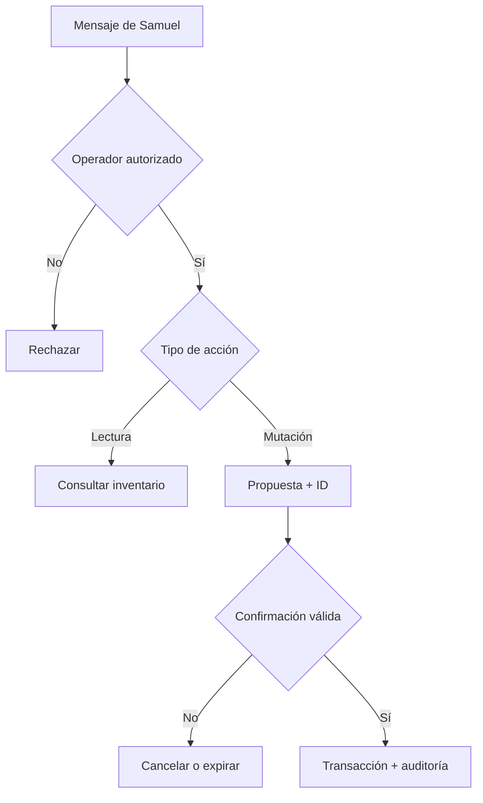

# Diagrama — Administración segura de inventario

```mermaid
flowchart TD
    A["Mensaje de Samuel"] --> B{"Operador autorizado"}
    B -- "No" --> C["Rechazar"]
    B -- "Sí" --> D{"Tipo de acción"}
    D -- "Lectura" --> E["Consultar inventario"]
    D -- "Mutación" --> F["Propuesta + ID"]
    F --> G{"Confirmación válida"}
    G -- "No" --> H["Cancelar o expirar"]
    G -- "Sí" --> I["Transacción + auditoría"]
```
