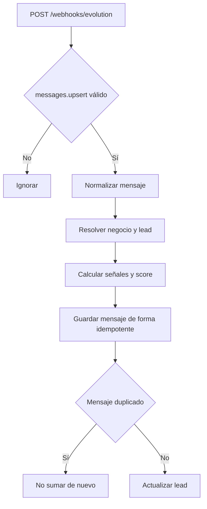

# Diagrama — Flujo interno del webhook y scoring

```mermaid
flowchart TD
    A["POST /webhooks/evolution"] --> B{"messages.upsert válido"}
    B -- "No" --> C["Ignorar"]
    B -- "Sí" --> D["Normalizar mensaje"]
    D --> E["Resolver negocio y lead"]
    E --> F["Calcular señales y score"]
    F --> G["Guardar mensaje de forma idempotente"]
    G --> H{"Mensaje duplicado"}
    H -- "Sí" --> I["No sumar de nuevo"]
    H -- "No" --> J["Actualizar lead"]
```

Este flujo termina en persistencia y scoring; todavía no genera ni envía respuestas.
