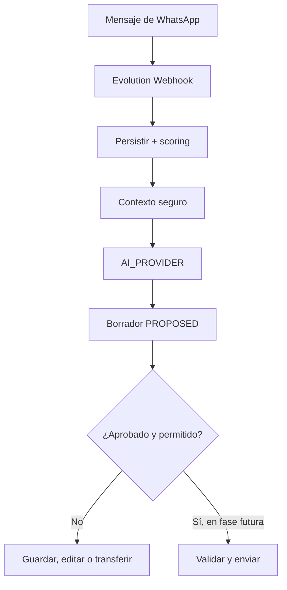

# Diagrama — Flujo Principal WhatsApp a IA

```mermaid
flowchart TD
    A["Mensaje de WhatsApp"] --> B["Evolution Webhook"]
    B --> C["Persistir + scoring"]
    C --> D["Contexto seguro"]
    D --> E["AI_PROVIDER"]
    E --> F["Borrador PROPOSED"]
    F --> G{"¿Aprobado y permitido?"}
    G -- "No" --> H["Guardar, editar o transferir"]
    G -- "Sí, en fase futura" --> I["Validar y enviar"]
```

En el Hito 4.2 el flujo termina en `Borrador PROPOSED`.
