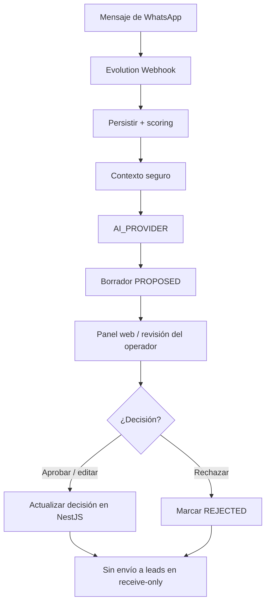

# Diagrama — Flujo Principal WhatsApp a IA

En el piloto Edgar el flujo termina en la revisión y persistencia de la
decisión, sin envío a leads. WhatsApp solo puede recibir una notificación o
preview opcional en el canal del operador.
