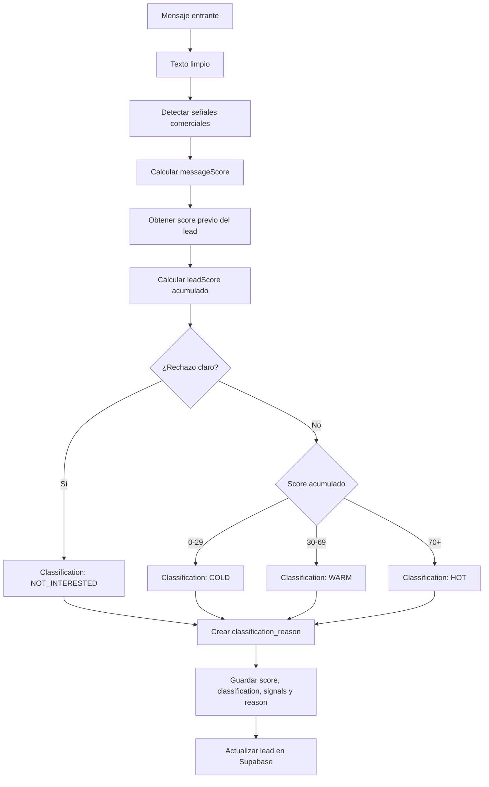

# 🧩 Diagrama — Hito 3.2 Scoring Avanzado

```mermaid
flowchart TD
    A[Mensaje entrante] --> B[Texto limpio]
    B --> C[Detectar señales comerciales]
    C --> D[Calcular messageScore]
    D --> E[Obtener score previo del lead]
    E --> F[Calcular leadScore acumulado]
    F --> G{¿Rechazo claro?}
    G -- Sí --> H[Classification: NOT_INTERESTED]
    G -- No --> I{Score acumulado}
    I -- 0-29 --> J[Classification: COLD]
    I -- 30-69 --> K[Classification: WARM]
    I -- 70+ --> L[Classification: HOT]
    H --> M[Crear classification_reason]
    J --> M
    K --> M
    L --> M
    M --> N[Guardar score, classification, signals y reason]
    N --> O[Actualizar lead en Supabase]
```
