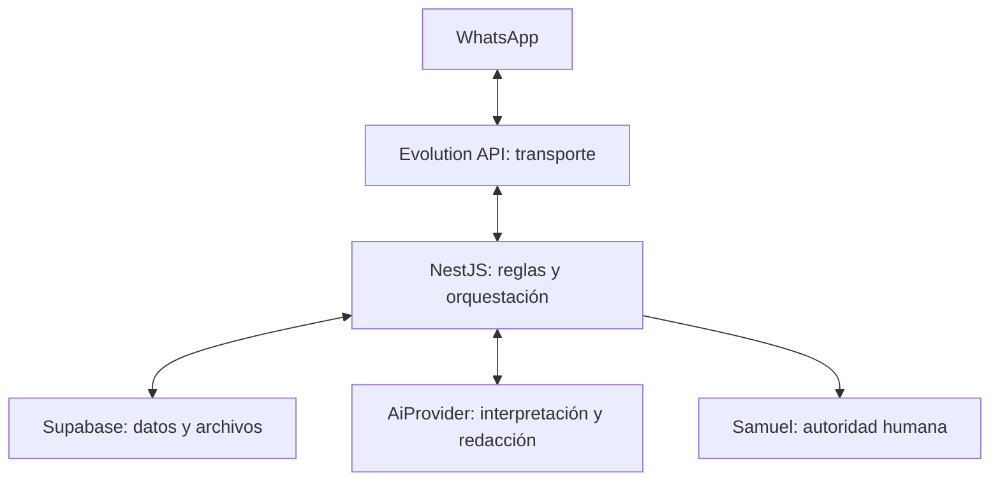

# Diagrama — Modelo mental del sistema

```mermaid
flowchart TD
    A["WhatsApp"] <--> B["Evolution API: transporte"]
    B <--> C["NestJS: reglas y orquestación"]
    C <--> D["Supabase: datos y archivos"]
    C <--> E["AiProvider: interpretación y redacción"]
    C --> F["Samuel: autoridad humana"]
```

La IA propone; NestJS valida; Samuel conserva la autoridad sobre acciones delicadas.
