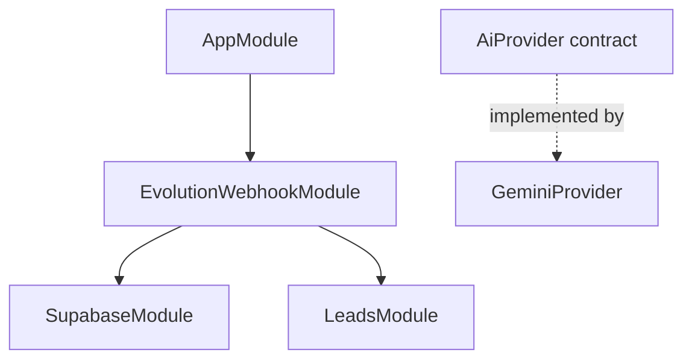

# Arquitectura actual observada

<!-- AUTO:BEGIN architecture -->

`GeminiProvider` existe y está probado, pero todavía no está registrado en un módulo ni conectado al webhook. `ConversationContextService`, `ResponseDraftService`, inventario, reportes, medios y envío permanecen fuera de la implementación observada.
<!-- AUTO:END architecture -->
