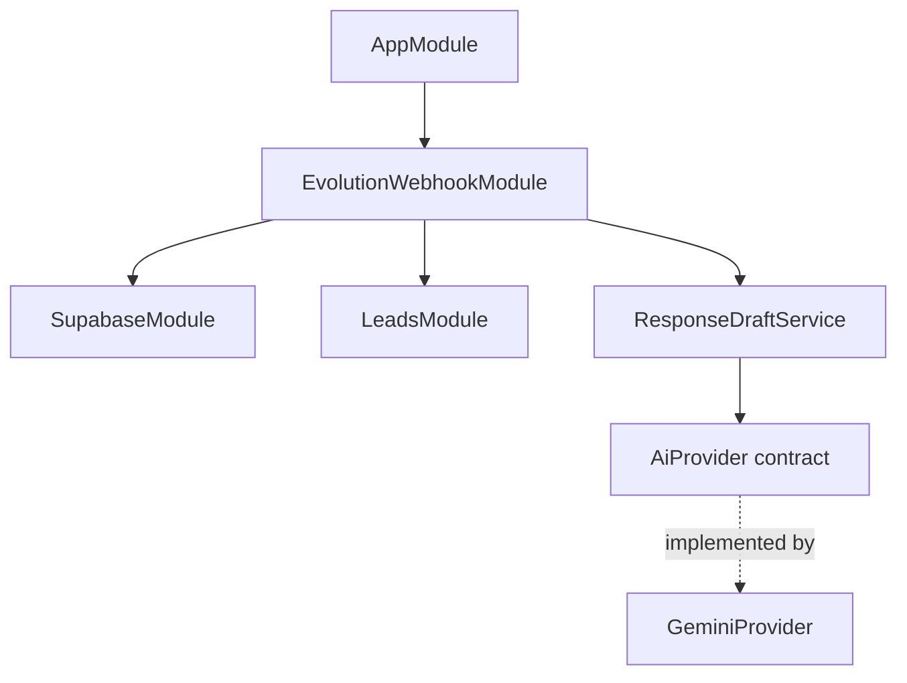

# Arquitectura actual observada

<!-- AUTO:BEGIN architecture -->

`GeminiProvider` está registrado en el runtime.

`EvolutionWebhookService` llama a `ResponseDraftService`, que usa `AI_PROVIDER` para generar borradores. El flujo los persiste como `PROPOSED`; no envía mensajes a WhatsApp.
<!-- AUTO:END architecture -->
