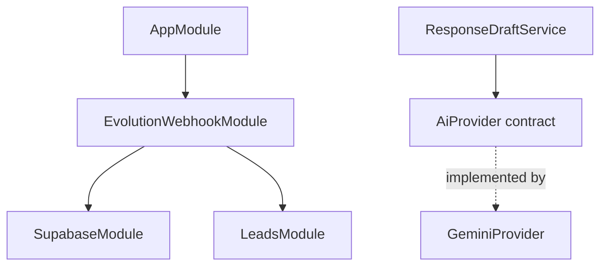

# Arquitectura actual observada

<!-- AUTO:BEGIN architecture -->

`GeminiProvider` está registrado en el runtime.

El contrato de IA no está conectado al webhook; no puede generar ni enviar respuestas desde ese flujo.
<!-- AUTO:END architecture -->
